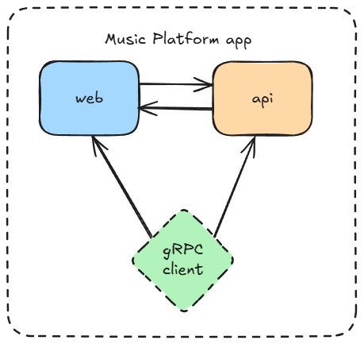
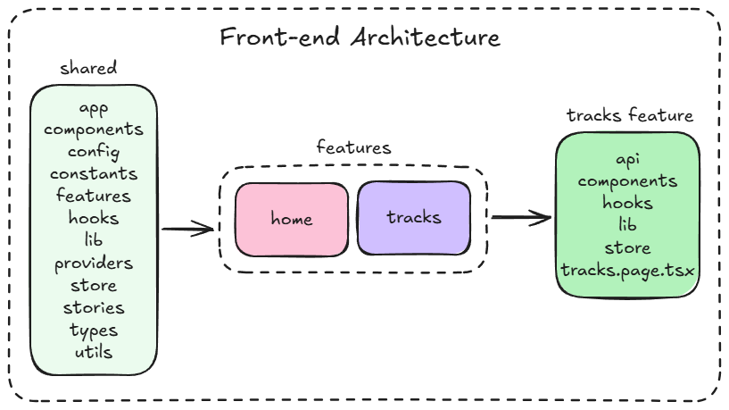

# Music Platform

Music Platform is a modern web application for managing and listening to music tracks. It allows users to create, edit, delete, and organize tracks with features such as filtering, sorting, searching, and pagination. The platform includes an audio player with advanced controls, audiowave visualization, and supports both dark and light modes. Designed for a smooth user experience, it also offers bulk actions, optimistic UI updates, and robust error handling.

## Setup

1. Install dependencies

```bash
pnpm install
```

2. Add environment variables

```bash
cp .env.example .env
```

3. Run the app

- in development mode

```bash
pnpm run dev
```

- in production mode

```bash
  pnpm build
  pnpm preview
```

## Bundle analyzing

## Tech stack

### General

- Turborepo
- Typescript
- ESlint

### Front-end

- Vite
- TanStack Query
- shadcn
- zustand
- Vitest
- Playwright
- SocketIO

### Back-end

- Fastify
- ConnectRPC
- Vitest
- SocketIO

## Infrastructure



- Monorepo managed with Turborepo, containing both frontend and backend apps.

- Frontend is a Vite-based React app, using TanStack Query for data fetching, Zustand for state management, and shadcn/ui for UI components.

- Backend is a Fastify server, exposing APIs via ConnectRPC (gRPC-web), serving static files, and handling real-time features with Socket.IO.

- Data Storage is file-based (JSON and uploads) within the repo, with directories for tracks, genres, and uploaded audio.

- Environment configuration is managed via .env files, loaded and validated at runtime.

- Development uses pnpm for package management, with scripts for dev, build, lint, and test.

- Testing is set up for both frontend (Playwright, Vitest) and backend (Vitest).

## Architecture

### Front-end



Frontend architecture is based on the **Bulletproof React**. Application has shared layer with common components and hooks, features layer with feature-specific components and hooks, and app layer with page-specific components and hooks.

- **app** - app layer with page-specific components and hooks
- **components** - components folder with shared components
- **config** - config folders contains config files (like env variables)
- **constants** - constants folder contains constants (like routes, colors, etc)
- **features** - features layer with feature-specific components and hooks
- **hooks** - hooks folder with shared hooks
- **lib** - lib folder with library related utils
- **providers** - providers folder with shared providers
- **store** - store folder with shared stores
- **stories** - stories layer with component documentation
- **types** - types folder with shared types
- **utils** - utils folder with shared utils

## Rendering strategy

### Pages

- `/` - RSC with Track card rendered on the client
- `/tracks` - RSC with interactive elemented rendered on the client
- `/tracks/:slug` - SSR with Track audio player rendered on the client

### Pros

- Fast initial load
- Fast navigation
- Fast page refresh

### Cons

- Hard to combine react query caching with SSR
- Hard to implement optimistic UI updates with SSR

## Impact

- **UX** - Fast initial load, fast navigation, fast page refresh
- **SEO** - Improved SEO for static pages and pages rendered on the server
- **Performance** - Improved LCP, FCP, TTFB
